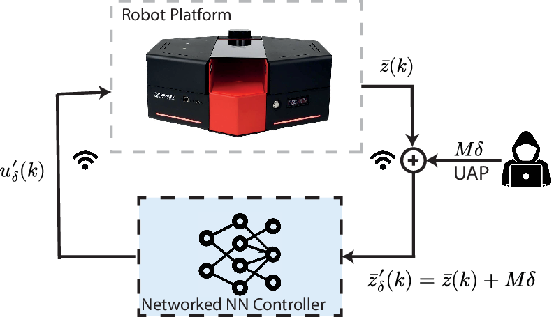
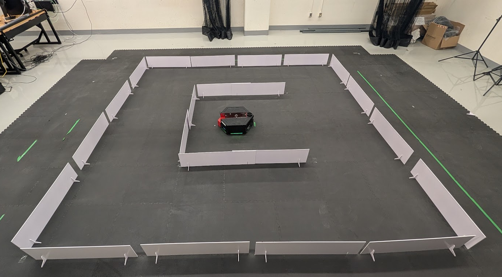

# Universal Perturbation Attacks on Neural Network Controllers for Wheeled Mobile Robots

**Authors:** Suryaprakash Rajkumar, Ehsan Eslami, Walter Lucia, and Amr Youssef

**Code maintainer:** Suryaprakash Rajkumar

## What are we trying to do?

A mobile robot can learn to follow a reference path by imitating an expert
controller. This approach, called **behavioral cloning (BC)**, works well under
normal conditions—but small, carefully chosen changes to the robot's sensor
observations can cause the learned controller to drift away from its intended
trajectory.

This project studies that failure mode and a way to make the controller more
resilient. In particular, it provides tools to:

1. train a neural-network controller to track a reference trajectory;
2. compute one bounded **universal adversarial perturbation (UAP)** offline;
3. reuse that same perturbation on selected observation channels at every
   attacked control step;
4. test the controller against an input-dependent **Fast Gradient Sign Method
   (FGSM)** attack that is recalculated online at each control step; and
5. train a more robust controller using offline and online masked FGSM examples.

The key questions are simple: **can one small, fixed perturbation consistently
mislead a closed-loop robot controller, how does it compare with an online FGSM
attack, and can adversarial training reduce their effects?**

## Video demonstration

> YouTube demonstration coming soon.

<!-- Add the YouTube link here when it is available. -->

## Threat model



The attacker has white-box access to the trained policy and uses differentiable
closed-loop rollouts to optimize a single perturbation $\delta$. During
deployment, the attacker adds the same masked perturbation to the selected
observation channels. The perturbation is bounded by an $L_\infty$ constraint,
so every modified feature remains within a prescribed maximum change. The
controller then acts on the perturbed observation, while the physical robot and
its control loop are otherwise unchanged.

We also test an online FGSM attacker as a complementary threat. Unlike the UAP,
which remains fixed throughout deployment, the FGSM perturbation is recomputed
from the current observation and policy gradient at each attacked control step.
This comparison shows how the controllers respond to both reusable and
input-specific observation attacks.

The editable source for the figure is available as
[`docs/assets/threat_model.eps`](docs/assets/threat_model.eps).

## Experimental setup



The attack and defense are evaluated on a Quanser QBOT in a confined indoor
course. This setup lets us compare the nominal and adversarially trained
controllers under the same physical trajectory-tracking conditions, both with
and without UAP and FGSM observation attacks applied.

## Abstract

This paper investigates universal adversarial perturbation (UAP) attacks against
behavioral-cloning (BC) controllers for mobile robot trajectory tracking. We
consider a white-box inference-time attacker that computes a single bounded,
input-agnostic perturbation offline through differentiable closed-loop rollouts
and applies it unchanged to selected observation channels during deployment. The
perturbation is optimized to maximize closed-loop trajectory-tracking error
subject to an $L_\infty$ constraint. To improve robustness against
observation-space attacks, we propose an adversarial training strategy that uses
dual-stage Fast Gradient Sign Method (FGSM) training. The first stage augments
the training set offline with masked FGSM perturbations generated at multiple
perturbation levels, while the second stage generates masked FGSM perturbations
online from the current policy during training. The proposed attack and defense
are experimentally evaluated on the Quanser QBOT platform in a confined indoor
trajectory-tracking scenario, showcasing the vulnerabilities of the BC
controller to UAP attacks and the improved resilience achieved through
adversarial training.

## What is included?

- A behavior-cloning training pipeline and expert-data collection workflow.
- A closed-loop UAP optimizer plus online FGSM attack testing and a
  Gaussian-noise comparison.
- Dual-stage adversarial training with offline multilevel FGSM augmentation and
  online FGSM examples from the current policy.
- Simulation evaluation scripts for nominal and adversarially trained models.
- Ready-to-test model checkpoints and a ROS 2 node for the Quanser QBOT.

## Install

Use Python 3.10 or newer. Run commands from this folder:

```bash
python -m venv .venv
source .venv/bin/activate
python -m pip install -r requirements.txt
```

NumPy 2 or newer is required (`np.trapezoid`). CPU is supported; training can use
`--device cuda` when the installed PyTorch and host support it. ROS 2 is optional
and is needed only for the robot node.

## Quick start: test the supplied ROS model

```bash
python scripts/evaluate_policy.py
python scripts/evaluate_policy.py --uap --output-dir outputs/nominal_uap
python scripts/evaluate_policy.py --uap \
  --checkpoint models/sim2real_adversarial_policy.pt \
  --norm models/sim2real_adversarial_norm_stats.npz \
  --output-dir outputs/adversarial_uap
python -m pytest -q
```

The evaluator simulates a held-out lemniscate and writes trajectory NPZ files and
metrics JSON. `--uap` first optimizes one fixed vector on a different reference,
then applies it throughout the test rollout. For a quick execution check add
`--attack-steps 1 --attack-horizon 12`; this is not a research-quality attack.

## Train and simulate

```bash
# Expert collection, behavior cloning, simulation, UAP and Gaussian comparison
python scripts/run_workflow.py --config configs/default.json

# Domain-randomized collection, nominal training, multiscale FGSM defense
python scripts/train_sim2real_pair.py --device auto

# Re-evaluate a newly trained nominal policy
python scripts/evaluate_policy.py \
  --checkpoint artifacts/sim2real_nominal_policy.pt \
  --norm artifacts/sim2real_nominal_norm_stats.npz

# Evaluate the newly trained pair on identical randomized simulation trials
python scripts/evaluate_sim2real_interpolated_wall.py --trials 24
```

Training writes new files under `data/`, `artifacts/`, and `results/`; these are
gitignored. Supplied deployment files stay under `models/`.

## Contents and documentation

| Path | Purpose |
|---|---|
| `src/uap_il/` | Expert, dataset, residual network, training, UAP, kinematics, plots |
| `scripts/` | Training, testing, simulation and dataset tools |
| `models/` | Latest ROS nominal/adversarial checkpoints and paired normalization |
| `configs/default.json` | Portable auto-device settings, epsilon 0.25 |
| `configs/research.json` | Original research configuration snapshot |
| `tests/` | Robot, feature, dataset split, network and attack checks |
| `ros2_nn_trajectory_tracker/` | ROS 2 inference node, launch and configuration |

- [Training and dataset contract](docs/training.md)
- [Testing, simulation and attacks](docs/testing_and_uap.md)
- [Sim-to-real and ROS instructions](docs/sim2real.md)
- [Model identity](models/README.md)
